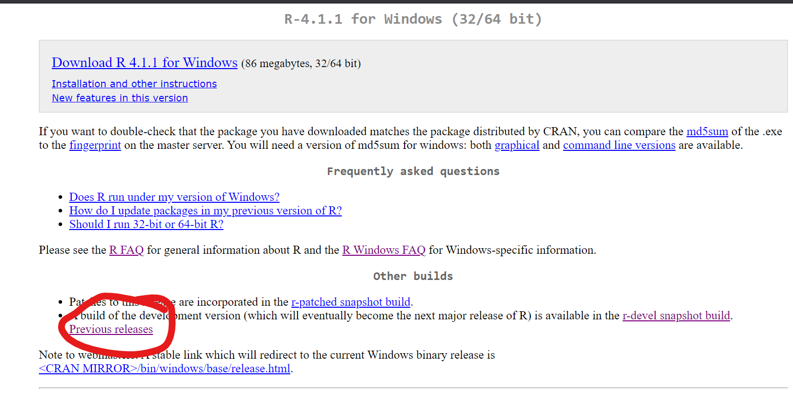

<!-- README.md is generated from README.Rmd. Please edit that file -->

```{r, include = FALSE}
knitr::opts_chunk$set(
  collapse = TRUE,
  comment = "#>",
  eval = FALSE,
  echo = TRUE
)
```

# auto-sort

<!-- badges: start -->
<!-- badges: end -->

## Objectives

The auto-sort program reviews interviews, based on a set of rules, and determines how they should be handled:

- Approved
- Rejected
- Reviewed further
- Flagged for persistent issues

The program then, optionally, executes those decisions by rejecting interviews on the Survey Solutions server and saving locally a compilation of interviews that require manual action (e.g., review to decide whether to reject, discuss with field staff where errors persist, etc.).

## Installation

Before running this program for the first time, (re)install the following software:

- [R](#r)
- [RTools](#rtools)
- [RStudio](#rstudio)

Even if these software packages are already installed, it is necessary to reinstall them in order to have the latest version of these tools for this program to work successfully.

Please read below about how to install these programs.

### R {#r}

- Follow this [link](https://cran.r-project.org/)
- Click on the appropriate link for your operating system
- Click on `base`
- Download and install (e.g., [this](https://cran.r-project.org/bin/windows/base/R-4.1.1-win.exe) for Windows)

### RTools {#rtools}

Required for the Windows operating system.

- Follow this [link](https://cran.r-project.org/)
- Click on `Windows`
- Click on `RTools`
- Download and install (e.g., [this](https://cran.r-project.org/bin/windows/Rtools/rtools40v2-x86_64.exe) for a 64bit system)

This program allows R to compile C++ scripts used by certain packages (e.g., `{dplyr}`).

### RStudio {#rstudio}

- Follow this [link](https://www.rstudio.com/products/rstudio/)
- Select RStudio Desktop then Open Source Edition
- Click on the appropriate link for your operating system
- Download and install (e.g., [ceci](https://www.rstudio.com/products/rstudio/download/#download) for Windows)

### This program

- Get a copy of this repository
  - Navigate to [this repository](https://github.com/arthur-shaw/uhis_auto_sort)
  - Click on the `Code` button
  - Click on `Download ZIP`
  - Dowload to the desired folder on your machine

- Unpack the zip file

TODO: update image to be screenshot of this repo

## Usage

### Provide program paramters

This involves:

1. Providing the file path to the program
1. Specifying how the program should behave
1. Providing details for connecting to the Survey Solutions

#### Providing the file path to the program

For the program to run, it needs to know where it is located in your file system. To get the program oriented, provide the file path to the root of the project (i.e., directory in which `auto-sort.Rproj` is located). This path should be specified as the value of `proj_dir` (i.e., in the quotes)

When doing so, follow the rules repeated in the code chunk below:

- Use `/` instead of `\` in file path. In R, `\` means something special.
- Be sure to put / at the end of the path. This will help with constructing other file paths relative to the root.

```{r}
# =============================================================================
# Locate project root
# =============================================================================

# follow these guidelines in specifying the root folder
# - use / instead of \ in file path
# - be sure to put / at the end of the path
proj_dir    <- ""
```

#### Specifying how the program should behave

The program needs to know how to act in two dimensions:

1. Which Survey Solutions interview statuses to consider for review
2. Whether the program should reject any reviews recommended for rejection

The `statuses_to_reject` variable captures the comma-separated list of statuses subject to review. See the notes below on which interview statuses are currently allowed.

The `should_reject`variable captures whether or not interviews recommended for rejection should be automatically rejected. See the code chunk below on how the values are interpretted.

```{r}
# =============================================================================
# Program behavior parameters
# =============================================================================

# Provide a comma-separated list of interview statuses to review.
# See status values here: https://docs.mysurvey.solutions/headquarters/export/system-generated-export-file-anatomy/#coding_status
# Statuses supported by this script include: 
# - Completed: 100
# - ApprovedBySupervisor: 120
# - ApprovedByHeadquarters: 130
statuses_to_reject <- c(100, 120)

# Whether to reject interviews recommended for rejection
# - If TRUE, the program will instruct the server to reject these interviews.
# - If FALSE, the program will not.
# - In either case, the interviews recommended for rejection, and the reasons why, are saved in `/output/`
should_reject <- TRUE
```

#### Providing details for connecting to the Survey Solutions

In order for the program to interact with your server in any way--whether that is downloading data or rejecting interviews--it needs connection details.

These details are as follows:

- `server`. Full URL or the server.
- `workspace`. Workspace name--not the display name.
- `user`.  User name for an admin or API user authorized for the workspace above.
- `password`. Password for that user.

```{r}
# =============================================================================
# Provide Survey Solutions details
# =============================================================================

server      <- ""
workspace   <- ""
user        <- ""
password    <- ""

susoapi::set_credentials(
    server = server,
    user = user,
    password = password
)
```

For more information on why this information is needed and how it is used, please read about Survey Solutions authentication [here](https://arthur-shaw.github.io/susoapi/articles/authentication.html)

### Run the program

Once the preparation above completed and saved, it is time to run the program. To do so:

- Open RStudio
- Open the file `auto-sort.Rproj`, which will have the effect of loading the project resources.
- Open the file `_run.R`, which you modified above
- Run the program
- Accept to update packages, if prompted

After openting the file `_run.R`, RStudio will display a message like the following:


- The `{renv}` package, which is responsible for package version control, has been installed
- The version of R on your machine either does or does not match the version indicated in the version control file.

If your version of R does not match the expected R version, please install the expected version. If the R version is older than yours, please search for the expected version on CRAN:

- Follow the instructions [here](#r)
- Follow the link shown below

- Find, get, and install the expected version (e.g., 4.1.1)
![]

Upon launching the project, RStudio will ask if you want to install the packages required by this project, as shown below.


Key `y` in the RStudio console. This will create a project-specific library of packages whose versions match those needed for the project. This will not have any impact on, say, newer versions of the same packages installed on your machine. To learn more, review the documentation for {renv} [here](https://rstudio.github.io/renv/articles/renv.html).

### Troubleshooting

#### Known problems

If you run the program as described above and encounter an error that ressembles the one pictured below, R has faced a problem downloading and installing the required packages.


To overcome this problem, please follow the following steps:

-	Open the Rproj file
-	Before running the program, execute the command:  `Sys.setenv(RENV_DOWNLOAD_METHOD = "wininet")`
-	Run the program

If the program still fails, it is likely that R--or rather the `{renv}` package--has encountered a problem installing a package from GitHub.

To help R install such packages, please follow these steps:

- Open a new instance of RStudio. In other words:
  - Close all RStudio windows open
  - Open RStudio again
  - Make sure that the `auto-sort` project is closed. If needed, close it as pictured below:


TODO: update screenshot to show auto-sort in menu

- Install the missing packages by executing the commands below:

```{r}
# first, install devtools, which allows installation of packages hosted on GitHub
install.packages("devtools")

# then install those packages hosted on GitHub
devtools::install_github("arthur-shaw/susoapi")
devtools::install_github("arthur-shaw/susoflows")
devtools::install_github("arthur-shaw/susoreview")
```

- Launch the program again as described [here](#lancer)

#### Unknown problems

If you have a GitHub account, create an issue [here](https://github.com/arthur-shaw/uhis_auto_sort).

If you do not have an account, send an email.

In both cases, be sure to provide a detailed description and, if possible, a resproducible example. In the detailed description, send:

- Description of the steps followed
- Error message, either as a screenshot or as text copied from the RStudio console
- Information on your workspace and R session, by executing the following commands just after the program fails and copy-pasting the result:

```{r}
# this provides detailed information on the actions undertaken by {renv}
# in installing the required packages, and highlights 
# the problems encountered and the parameters used
renv::diagnostics()

# these commands provide information on the:
# - method used for downloading packages
# - repository from which where the packages are fetched
getOption("download.file.method")
capabilities("libcurl")
getOption("repos")

# this command provides information on your workspace and R environment
sessionInfo()
```

In the reproducible example, provide data or connection details by secure means only (i.e., not GitHub, nothing publict where others can see your data or server connection details).